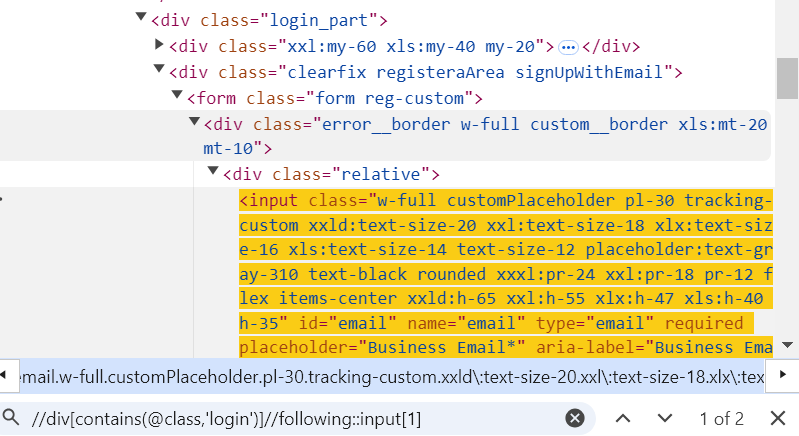
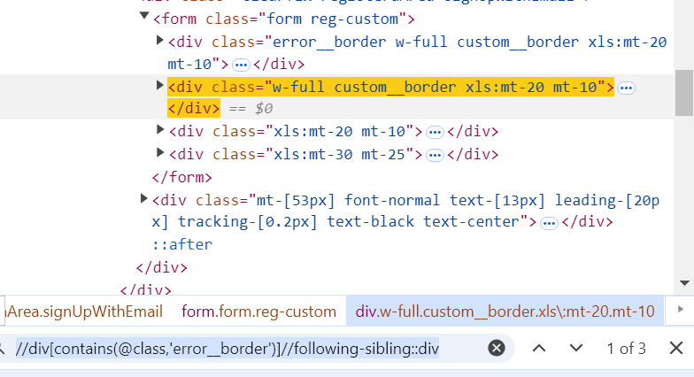
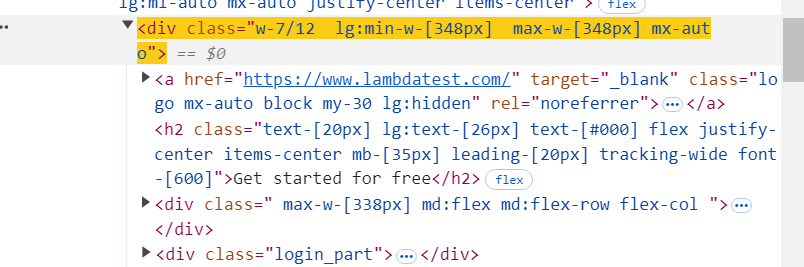

## Advanced Xpath Locators

### 1. Xpath syntax?

```java
Xpath=//tagname[@attribute='value']
```

### Xpath using Following?
Following selects all the nodes that follow current node.
It selects everything in the document after the closing tag of the current node.



```java
//tagname[@attribute=’value’]//following::tagname 

https://accounts.lambdatest.com/register?_gl=1*196o109*_gcl_au*NzQ3MjMwODk5LjE3MjYxNTUzMDg.

//div[contains(@class,'login')]//following::input
```

### Xpath using Following-Sibling?

The following-sibling selects all sibling nodes after the current node which are same level as current node.



```java
//div[contains(@class,'error__border')]//following-sibling::div
```

### Xpath using Parent?

XPath using the parent axes is a method used to select the parent node of the current node in an XML or HTML document.



```java
//div[contains(@class,'login')]/parent::div
```

